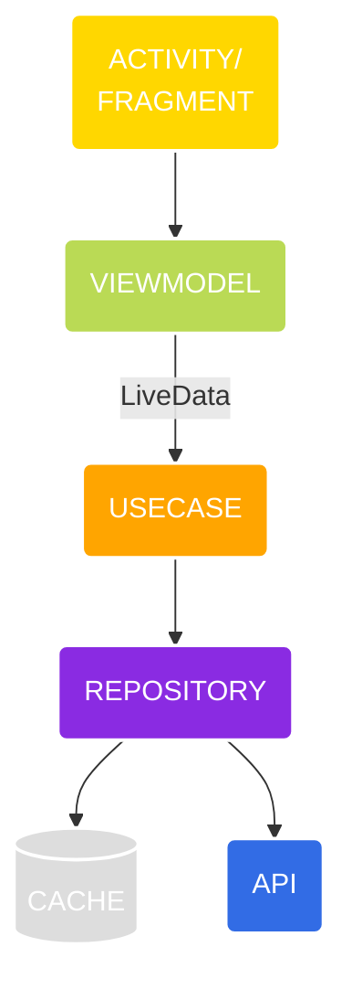

# Clean architecture - Android

There are some important questions to make when you begin the study of the clean architecture, below are a few of them focusing the Android app development.

- Why it’s important to use architecture patterns in software
- What *Clean Architecture* is
- What *SOLID* principles of development are
- When to use Clean Architecture and SOLID principles
- How to implement Clean Architecture on Android

The common goal to Software Architecture Study is manage the complexity of the applications in general.

Considering the observation starts from the outer border of the graph, farther the circle, most abstract is the structure. The structures shown at the graph above were presented at the table below according to the Abstraction Principle that specifies the farther circle should contain business logic whereas the closer circle should contain the implementation details.

| Blue Layer (most concrete) | Green Layer | Red Layer | Yellow Layer (most abstract) |
| :------------------------: | :---------: | :-------: | :--------------------------: |
|          Devices           | Controllers | Use Cases |           Entities           |
|       DB (Data base)       |  Gateways   |           |                              |
|    External interfaces     | Presenters  |           |                              |
|    UI (User interface)     |             |           |                              |
|            Web             |             |           |                              |

It's significant to point out the "Dependency Rule" of the Clean Architecture says that each circle is related only and just only to its nearest inward circle.

